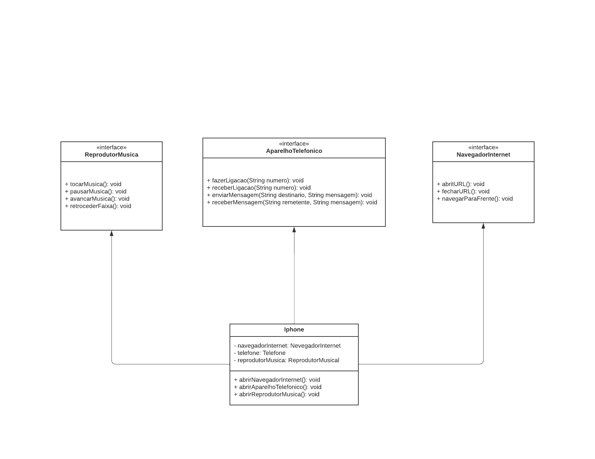

# Diagrama-de-class-UML
POO - Desafio
Modelagem e diagramação da representação em UML e Código não que se refere ao componente iPhone.

Com base no vídeo de lançamento do iPhone conforme link abaixo, elabore em uma ferramenta de UML de sua preferência a diagramação das classes e interfaces com a proposta de representar os papéis do iPhone de: Reprodutor Musical, Aparelho Telefônico e Navegador na Internet. Em seguida, crio as classes e interfaces no formato de arquivos .java

Lançamento iPhone 2007

Minutos relevantes das 00:15 às 00:55
Comportamentos esperados:
Redutor Musical: tocar, pausar, selecionar Música
Aparelho Telefônico: ligar, atender, iniciarCorrerioVoz
Navegador na Internet: exibirPagina, adicionarNovaAba, atualizarPagina

## Diagrama de Classe

 

